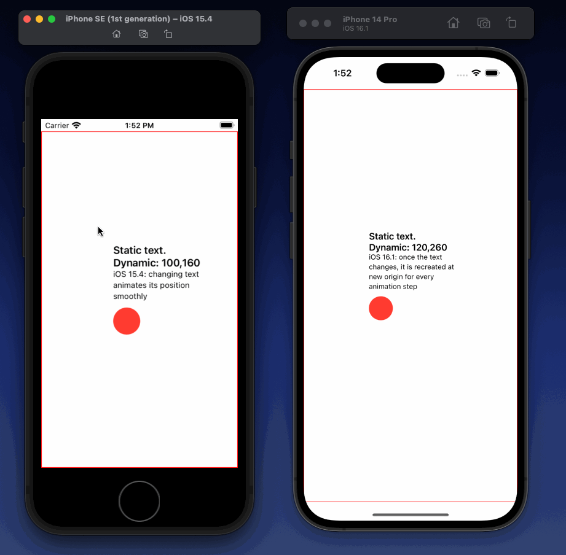

# iOS16 text animation regression sample

We are setting a position of text inside `withAnimation {}` block. On iOS 15, the text position is animated as expected, but on iOS 16, once the text value changes, it becomes considered a new object (despite having the same `id`), and is animated by fading out the old value at the old position, and fading in the new value at the new position.

How can we get back the iOS 15 behavior?

See the `FollowFingerText` component - [link to code](https://github.com/tkafka/ios16-text-animation-bug/blob/main/test-text-animation/ContentView.swift#L54).

Screen recording of the issue:

